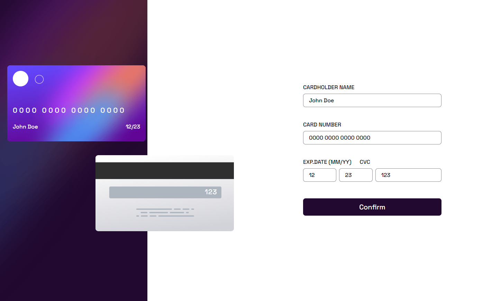

# FrontEnd Mentor Challange

This is a solution to the [Interactive card details form challenge on Frontend Mentor](https://www.frontendmentor.io/challenges/interactive-card-details-form-XpS8cKZDWw).

### Screenshot

### Built with

- Semantic HTML5 markup
- CSS3
- Flexbox
- CSS Grid
- [Styled-components](https://styled-components.com/) - NPM package for styling purpouses
- React router
- [Framer motion](https://www.framer.com/motion/) - NPM package for animation purpouses
- [React](https://reactjs.org/) - JS framework
- [react-spring](https://react-spring.dev/) - Physics based animation library

### Links

- [Live Site URL](https://interactive-cards-page.netlify.app/)

### Things implemented

- Responsive design
- Animations 
- Modal
- Global state (done with context API)
- Form validation
- Regular expressions
- Conditional rendering

### Things learned

- Use of react-spring library
